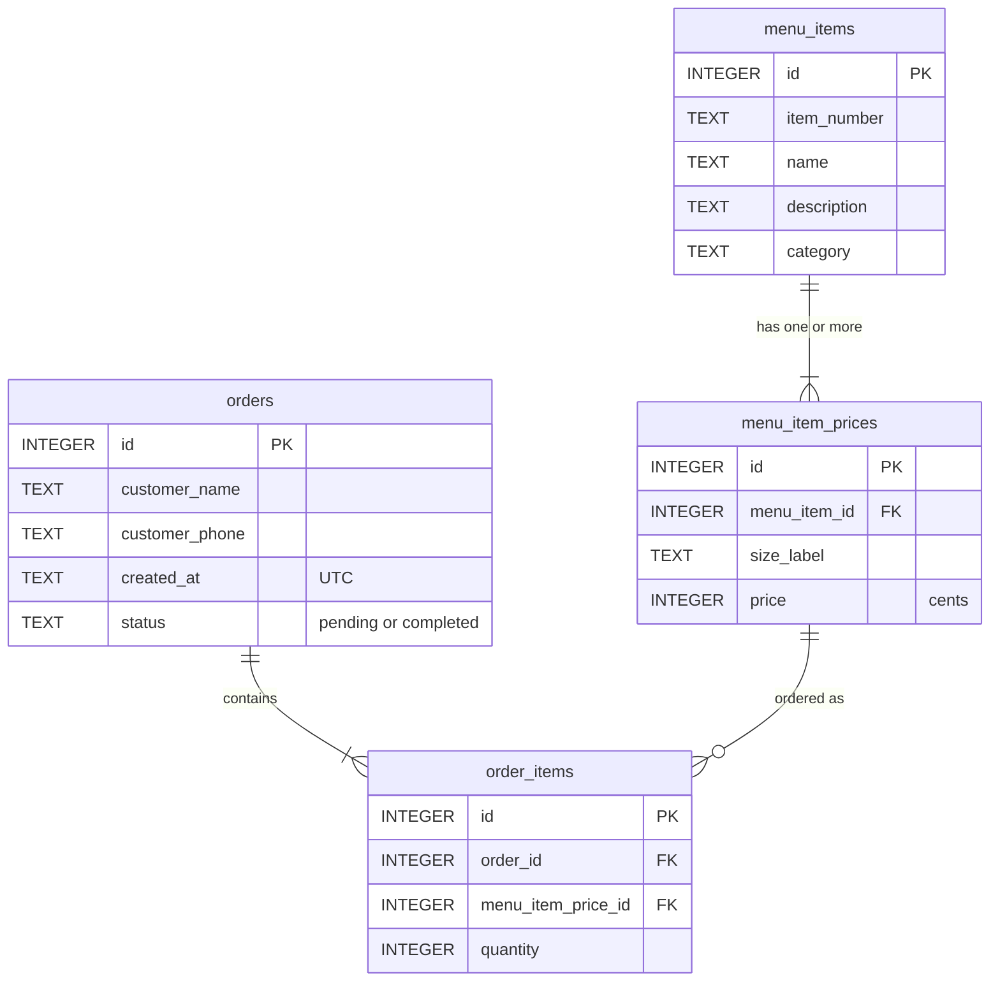

# China Chef — Online Ordering Menu System

A full-stack ordering site for my family's restaurant. The structure includes customers browsing a database-driven menu and placing orders, and staff managing incoming orders from a password-protected admin page.

**Live demo:** https://china-chef-demo.onrender.com/

> This is a portfolio project modeled on my family's restaurant. Orders placed on the demo are **not** sent to the restaurant. The demo runs on a free hosting tier, so the first visit after a period of inactivity can take up to a minute to load.

## Features

- **Menu from a database.** Items, descriptions, and prices are stored in SQLite and rendered with Jinja2 templates. Items can have a single price or several sizes (Small / Large / Extra Large).
- **Online ordering.** Customers choose quantities for any item or size, enter their name and phone number, and get a confirmation page with line items and an order total.
- **Admin dashboard.** A password-protected page lists pending orders (oldest first, like a kitchen queue) and recently completed ones, with times shown in the restaurant's local time. Staff mark orders complete with one click, and the page refreshes itself every 30 seconds.
- **Input validation and friendly errors.** Every form value is rechecked on the server, and problems are shown on a styled error page rather than as a crash.
- **Responsive layout.** Works on phones as well as desktops.

## Tech stack

| Layer | Technology |
|---|---|
| Backend | Python, Flask |
| Templates | Jinja2 (with template inheritance and macros) |
| Database | SQLite, accessed with raw SQL through Python's `sqlite3` module (no ORM) |
| Frontend | HTML, CSS (no JavaScript) |
| Deployment | Render, served by gunicorn |

## Database schema



- `menu_item_prices` is separate from `menu_items` because items have different numbers of sizes (one price, Small/Large, or Small/Large/Extra Large). Each size is just another row.
- `order_items` is a junction table resolving the many-to-many relationship between orders and the specific item-and-size that was ordered.

## Technical highlights

- **SQL injection prevention.** Every query that includes user input uses parameterized `?` placeholders, so input is always treated as data and never as SQL. Tested by submitting a name containing `DROP TABLE`, where it was stored as plain text.
- **Money stored as integer cents.** Prices are integers (`375` = $3.75) to avoid floating-point rounding errors when adding up order totals. They're converted to dollars only for display.
- **The server never trusts the browser.** The order form sends only item IDs and quantities, and the server looks up prices itself, so prices can't be tampered with. Quantities, lengths, and item IDs are validated on the server, and foreign key constraints reject nonexistent items.
- **Orders saved in a single transaction.** An order and all its line items are written together; if any part fails, nothing is saved.
- **Post/Redirect/Get.** After an order is placed, the browser is redirected to the confirmation page, so refreshing can't create a duplicate order.
- **Admin security.** HTTP Basic Auth with the password kept in an environment variable, never in the code; the page is disabled entirely if no password is set; credentials are compared in constant time; and the "mark complete" action rejects requests coming from other websites (CSRF protection).
- **Timestamps in UTC,** converted to Central time only when displayed.

## Running locally

Requires Python 3.9 or newer.

```bash
git clone https://github.com/ericwei2235/restaurant-menu-system.git
cd restaurant-menu-system

python -m venv venv
# Windows (PowerShell):
.\venv\Scripts\Activate.ps1
# macOS / Linux:
source venv/bin/activate

pip install -r requirements.txt
python init_db.py          # creates restaurant.db from schema.sql and seed.sql
```

Set an admin password, then start the app:

```bash
# Windows (PowerShell):
$env:ADMIN_PASSWORD = "choose-a-password"
# macOS / Linux:
export ADMIN_PASSWORD="choose-a-password"

python app.py
```

Then open http://127.0.0.1:5000 for the menu, or http://127.0.0.1:5000/admin for the admin page (username `admin`). Without `ADMIN_PASSWORD`, the admin page stays disabled.

To reset all data, stop the app, delete `restaurant.db`, and run `python init_db.py` again.

## Project structure

```
app.py              Flask routes, database access, validation, admin authentication
init_db.py          Builds restaurant.db from the SQL files
schema.sql          Table definitions
seed.sql            Menu items and prices
requirements.txt    Python dependencies
templates/
  base.html         Shared layout (header, footer, stylesheet)
  menu.html         Menu and order form
  confirmation.html Order confirmation
  admin.html        Admin dashboard
  error.html        Error page
static/
  style.css         Styles
```

## Deployment

Hosted on Render's free tier:

- **Build command:** `pip install -r requirements.txt && python init_db.py`
- **Start command:** `gunicorn app:app`
- **Environment variable:** `ADMIN_PASSWORD`

The database is rebuilt from the SQL files on every deploy. Because the free tier's filesystem isn't persistent, orders are cleared whenever the service redeploys or restarts after being idle. The menu is always available.

## Known limitations

- Orders don't persist long-term on the free hosting tier (see Deployment).
- Order numbers are sequential, so confirmation pages could be viewed by guessing their URL. A production version would use unguessable order links.
- The menu contains a representative subset of the restaurant's real menu, not the full menu.

## Roadmap

- **v1.5:** Online payments using Stripe in test mode.
- **v2:** A React frontend backed by a Flask REST API.
